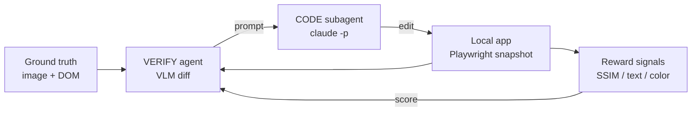
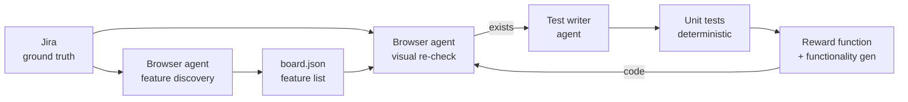
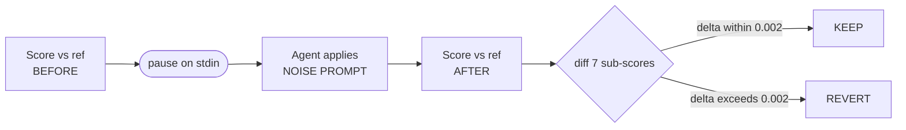

# Cloning Jira with Agentic Reward Functions

## Problem

> "Synthetic clones often have simpler DOM structures than original apps, even when visually identical."

### High-level goals

- **Align DOM** — Match Fira's DOM to real Jira on fixed UI surfaces.
- **Visual Similarity** — Preserve or enhance visual fidelity between clone and reference.
- **Verify Behavior** — Ensure interactive behaviors survive alignment without regressions.
- **Full Autonomy** — Create a process drivable by coding agents without human intervention.

### TL;DR

I built an agent harness which uses a set of reward signals that run a **verify → code** loop until the reward numbers go up. The reward signals are the lever that moves the output — spanning visual fidelity, textual content, color palette, DOM structure, and functionality (via unit tests).

---

## Proposed Solution


| Stage                      | Focus             | Goal                                                                |
| -------------------------- | ----------------- | ------------------------------------------------------------------- |
| **1. Clone the Frontend**  | Visual Similarity | Preserve or enhance visual fidelity between clone and reference.    |
| **2. Clone Functionality** | Verify Behavior   | Ensure interactive behaviors survive alignment without regressions. |
| **3. Hydrate Complexity**  | Align DOM         | Match Fira's DOM to real Jira on fixed UI surfaces.                 |


---

## Stage 1: Clone the Frontend

To get a 1:1 copy, we first need the AI to match ground truth on the frontend.

Before anything, we take two inputs:

1. A raw **DOM snapshot** of the website
2. A raw **image** of the website

### Manual baseline process

1. Compare your local app to the ground truth and look for any visual differences.
2. When you spot a difference, open your local app, take a screenshot, and provide both the local screenshot and the ground truth image to the AI — along with specific instructions.
3. Visually confirm that a change was made.

### Agentic Reward Function Loop

To automate this, we use VLMs in a **Verify → Code** loop with optimized reward signals to signal progress to the LLM.




comparison

#### Reward function module

We use a subprocess instance of Claude Code (`claude -p`) that can spawn subagents, a local instance build, the raw DOM, and the raw image.

→ [Managed agents overview](https://platform.claude.com/docs/en/managed-agents/overview)

**Where to find it:** `[mcp/loop/](mcp/loop/)` — invoked with `npm run mcp:loop`.


| File                                                   | Role                                                                                                                    |
| ------------------------------------------------------ | ----------------------------------------------------------------------------------------------------------------------- |
| `[mcp/loop/index.mjs](mcp/loop/index.mjs)`             | Entrypoint / CLI (`--focus=<pqgram                                                                                      |
| `[mcp/loop/verifier.mjs](mcp/loop/verifier.mjs)`       | VERIFY agent + orchestrator (vision + planning; `score_app`, `get_reward_config`, `dispatch_to_worker`, `declare_done`) |
| `[mcp/loop/worker.mjs](mcp/loop/worker.mjs)`           | CODE subagent (`claude -p` headless, with session resume via `--resume <id>`)                                           |
| `[mcp/loop/mcp-client.mjs](mcp/loop/mcp-client.mjs)`   | MCP tool plumbing for `score_app` / `get_reward_config`                                                                 |
| `[mcp/loop/prompts.mjs](mcp/loop/prompts.mjs)`         | Verifier + worker system prompts and focus directives                                                                   |
| `[mcp/loop/config.mjs](mcp/loop/config.mjs)`           | Env knobs (models, turn limits, paths)                                                                                  |
| `[scripts/reward-check.mjs](scripts/reward-check.mjs)` | Reward function (SSIM / text / color / pq-gram / class-density)                                                         |


Invoke it:

```bash
npm run mcp:loop                                  # default app URL + no focus
npm run mcp:loop -- http://localhost:5173         # override app URL
npm run mcp:loop -- --focus=ssim                  # prioritize one sub-score
npm run mcp:loop -- "tighten sidebar spacing"     # extra guidance (positional)
```

**On instantiation:**

**VERIFY**

- We use `[scripts/reward-check.mjs](scripts/reward-check.mjs)` to get the current state of the local app.
- We open a Playwright browser and take a snapshot of the current local app, paired with the ground truth image.
- Based on the image diff, the verify agent launches a code subagent with a prompt.

**CODE**

- Given the instruction, the code agent implements the change instructed by the verify agent.
- On completion, the verify agent reviews the code and either:
  1. Resumes the current change with more granular instructions (worker context preserved via `--resume <session_id>` when the reward did **not** improve), or
  2. Continues onward to another function (worker context cleared on improvement).

> Verify → Code → Verify → Code → …

---

### Reward Functions (Visual Fidelity)

We define three reward functions for visual fidelity.

#### 1. Does the layout look similar to ground truth?

The naive solution is pixel-wise comparison. But comparing pixels with something like **Mean Squared Error** rewards:

> *"Can I generate an exact image of my UI, pixel-to-pixel?"*

rather than a fundamental understanding of design and code. Small shifts — a component 2px to the left — can tank the score.

Instead, we deploy **SSIM**. SSIM asks: *do the right structures show up in roughly the right places?*

Rather than comparing pixels one-by-one, SSIM slides a small window (11×11) across both images. At each position, it compares the two patches on three perceptually meaningful axes:

1. **Luminance** — are they equally bright?
2. **Contrast** — do they have equally strong variation?
3. **Structure** — do the pixels vary together in the same pattern?

…and takes an average of those scores.

The window looks something like an 11×11 grid:

```
. . ██ ██ ██ ██ . . .
. ██ .  .  .  .  . ██ .
. ██ .  .  .  .  . .  .
. . ██ ██ ██ .  . .  .   ← the letter S
. .  .  .  .  . ██ ██ .
. ██ .  .  .  .  . ██ .
. . ██ ██ ██ ██ . .  .
```

Instead of matching exact positions, SSIM asks: *does pixel at `(3, n)` have the same color/luminance as pixel at `(3, n+1)`?* This captures structure even with small shifts.

#### 2. Is the text a 1:1 match to ground truth?

We extract `body.innerText` from both the local app and ground truth and score them with **Gestalt pattern matching** (a port of Python's `difflib.SequenceMatcher.ratio`):

1. Find the longest contiguous matching substring between the two texts.
2. Recurse into the unmatched regions on either side of that match and repeat.
3. Sum the lengths of all matched blocks (`M`).
4. Score = `2*M / (len(ref) + len(gen))` — a value in `[0, 1]`.

This asks: *do the same runs of text appear at roughly the same density?* Gestalt has no understanding of **where** text is placed — that's surfaced through SSIM.

#### 3. Is the color scheme a 1:1 match to ground truth?

We score a **color histogram** of the page — which colors appear, and in what proportions — ignoring *where* on the page they land (SSIM already owns spatial placement).

**Process:**

1. Walk every visible element (`width ≥ 5px`, `height ≥ 5px`) in both ref and gen.
2. Pull `background-color` and `color` from computed styles.
3. Quantize each RGB to a 32-step bucket — `(126, 87, 200)` and `(125, 89, 201)` both collapse to `"96,64,192"`. This absorbs anti-aliasing and imperceptible hue drift.
4. Build a histogram of bucket → count for each page.
5. Score = `Σ min(ref[k], gen[k]) / max(total_ref, total_gen)` — a histogram-intersection ratio in `[0, 1]`.

The `min(...)` rewards overlap: if ref has 400 lavender elements and gen has 380, that bucket contributes 380. The `max(total)` denominator punishes both under- and over-painting — flooding the page with extra purple divs to pad the score also inflates the denominator, so gaming it is rate-limited.

This asks: *does the same palette show up in roughly the same proportions?*

---

## Stage 2: Clone Functionality

For functionality, we need a deterministic way to verify a feature works. That means a **frontend unit test** on the component.

### Manual process

1. Go to Jira and verify a feature exists.
2. Code it with AI locally.
3. Verify the code change works locally, manually.
4. Write a unit test for it locally.

### Automated pipeline




We create an agent for all four steps:

**1. Feature discovery.** A browser agent walks through Jira and creates a report of features, written to:

→ `[mcp/summary/tabs/board.json](mcp/summary/tabs/board.json)`

The agent lives in `[tests/browser-test.js](tests/browser-test.js)` and drives a real Chromium via the Playwright MCP server (`@playwright/mcp`). It reuses a persistent auth profile at `tests/.pw-profile-jira/` so the agent only has to sign into Atlassian once; every later run picks up the same session.

For each tab (`board`, `list`, `summary`, `calendar`, `timeline`), the agent is pointed at the live Jira URL and asked to enumerate every interactive affordance it can see: toolbar controls, group-by menus, filter panes, online-users chips, context menus, row actions, etc. Each discovered feature is emitted as a structured `feature_checks` entry with an `id`, a human description, and a pass/partial/fail/blocked verdict, then serialized into the tab JSON fixture.

Invoke it:

```bash
npm run browser-test -- --board
npm run browser-test -- --tab=list
npm run browser-test -- --board --only=feat.board.create-issue,feat.board.drag
npm run browser-test -- --board --skip-presence-only

```

**2. Write unit tests.** `[mcp/test-loop/](mcp/test-loop/)` — invoked with `npm run unit-test-writer`. Given the verified feature list from step 1, this loop produces a deterministic Playwright spec for each feature under `[tests/<tab>/<id>.spec.mjs](tests/board/)`.

Per feature, the loop does four things:

1. **Browser-verify.** A Playwright-MCP + Claude agent (`mcp/test-loop/browser-agent.mjs`) navigates to the live Jira URL and confirms the feature is actually present, emitting structured evidence: `PASS`, `PARTIAL`, `FAIL`, or `BLOCKED`, plus observed locators, URL assertions, and interactions. Non-`PASS` verdicts are recorded and skipped — they're a data point, not a reason to retry.
2. **Write the spec.** On `PASS`, a `claude -p` subprocess (`mcp/test-loop/code-worker.mjs`) authors `tests/<tab>/<id>.spec.mjs`. The writer is given the evidence as context and must produce a spec with at least `MIN_ASSERTIONS_PER_SPEC` `expect(...)` calls anchored to `data-testid` / ARIA role+name / exact attribute values (not brittle text-match fallbacks).
3. **Run the spec.** `npx playwright test <spec>` runs against live Jira. Must go green with the minimum assertion count. On failure, the writer's session is resumed — keeping its context — with the runner's `exitCode`, last 8KB of `stdout`, and last 4KB of `stderr` attached as diagnostic. Retry up to `MAX_FIX_DISPATCHES` times.
4. **Mutation check (optional).** With `MUTATION_CHECK=1`, after the spec goes green the harness snapshots `src/` + `public/`, runs a saboteur worker that removes the feature from the clone, and re-runs the spec — it must now fail. The harness then restores from snapshot and re-runs — it must pass again. This proves the spec is **load-bearing**: its assertions actually track the feature, rather than passing on incidental DOM that would survive the feature's removal.

Invoke it:

```bash
npm run unit-test-writer                                               # defaults to --board
npm run unit-test-writer -- --board
npm run unit-test-writer -- --tab=board --only=page.load,toolbar.search.present
npm run unit-test-writer -- --json=./mcp/summary/tabs/board.json
```

---

**3. Verify → Write loop.** `[tests/browser-test.js](tests/browser-test.js)` — invoked with `npm run browser-test -- --board`. Once specs exist, this is the continuous drift-detection loop that keeps the feature set honest as real Jira evolves.

It's the same browser agent as step 1 (Playwright MCP + Claude, persistent `tests/.pw-profile-jira/` auth profile), but now it's used in **verify-and-write-report** mode:

1. **Verify.** For each `feature_check` in `board.json`, the agent opens the live Jira URL and re-checks the feature against the evidence recorded at discovery time — same selectors, same assertions, same URL patterns.
2. **Write.** Every verdict is written to a fresh scorecard at `tests/reports/board-report-<timestamp>.json` — `PASS` / `PARTIAL` / `FAIL` / `BLOCKED` per feature, plus tool-use trace. The agent also appends back into `mcp/summary/tabs/<tab>.json` so the next `unit-test-writer` run sees the latest verdicts.
3. **Loop.** A feature that flips from `PASS` to `FAIL` or `PARTIAL` triggers a regeneration: re-run `unit-test-writer --only=<id>` to rewrite the stale spec against the new ground truth. Features that flip to `BLOCKED` (login wall, permissions error) are surfaced to the operator.

Invoke it:

```bash
npm run browser-test -- --board
npm run browser-test -- --tab=list
npm run browser-test -- --board --only=feat.board.create-issue,feat.board.drag
npm run browser-test -- --board --skip-presence-only
```

Env knobs: `ANTHROPIC_API_KEY` (required), `ANTHROPIC_MODEL` (default `claude-opus-4-7`), `HEADLESS=1`, `BOARD_MAX_TURNS_PER_CASE` (default `30`). Reports land in `tests/reports/`.

Once each spec is green against real Jira and load-bearing under the mutation check, it's handed to the reward function alongside the visual sub-scores. The LLM now has a deterministic signal for *"did I break functionality?"* on every dispatch.

**4. Continuous verification.** After unit tests are complete, they plug into the reward function and run deterministically on every change.

---

## Stage 3: Hydrate Complexity

To match real Jira, we inject DOM complexity that mirrors ground truth **without changing what the user sees**. We drive this with a **PQ-Gram** reward signal on the DOM and ARIA tree.

PQ-Gram generalizes n-gram similarity from strings to trees — exactly the shape of our data (both DOM and ARIA are labeled, ordered trees). It walks the tree, extracts fixed-shape tuples of `(ancestor labels, sibling labels)`, and scores two trees by how much their tuple "profiles" overlap.

> In short: PQ-Gram rewards *"does the tree look like Jira's in the same places?"* — the SSIM philosophy applied to tree structure.

### Two things PQ-Gram misses

PQ-Gram captures *tree shape* but misses two things real Jira is drowning in:

1. **Atomic CSS class soup.** Real Jira's compiled Emotion classes put 30+ tokens on a single `<button>`; a hand-written BEM clone sits at 2–3.
2. **Head-level chrome.** `ajs-`* metas, `X-B3-`* tracing, `dns-prefetch` links, Atlaskit design-token and Emotion `<style>` blocks, global CSS reset, `.village-`*/`.ap-`* cruft — none of it visible.

We score these separately.

#### Class-density reward (CSS code-gen)

`scripts/reward-check.mjs` adds a `class_density` sub-score:

- Walk every classed element, count tokens per `class=""`, compute `median / p90 / p99`.
- Reward is `min(gen.p90 / ref.p90, 1)` — ref p90 ≈ 30, so it rewards atomic-style class lists.
- We ignore token *shape* (hashed vs. readable); only density.

Costs 5pp ceded from DOM pq-gram:

```466:472:scripts/reward-check.mjs
  const raw =
    0.50 * gatedSSIM +
    0.20 * details.text +
    0.10 * details.color +
    0.05 * pqCombined +
    0.10 * a11yPq +
    0.05 * classDensity
```

#### Head-chrome noise (meta tags)

Anything the agent adds must be **reward-neutral**, or it's gaming the signal instead of mimicking Jira. So we built a before/after harness: `scripts/noise-check.mjs`, driven by `npm run noise -- --section <section>`.




**Protocol** (full spec in `prompts/noise-invariance.md`):

1. Score against reference → `BEFORE`.
2. Pause on stdin. Agent applies the noise edit per `NOISE PROMPT` — head tags copied verbatim from `reference_app/html/reference.html`.
3. `ENTER`. Score again → `AFTER`.
4. Diff seven sub-scores. If *any* moves by more than **±0.002** → `VERDICT: REVERT` — the edit changed the rubric. Otherwise → `VERDICT: KEEP`.

- ❌ **Exclude** (real side effects): `<link rel="preconnect|preload">` to external hosts, `<link rel="stylesheet" href="//…cloudfront.net/…">`, any `<script src="//…cloudfront.net/…">` or `chrome-extension://…`. Anything firing a network request at load time is out.

> **Together:** class-density pulls the clone's p90 into real-Jira territory, and the noise harness lets the agent safely stuff the `<head>` with Atlassian chrome without touching what the user — or the reward function — can see.

---

## Learnings

### Bottleneck: the browser agent

The biggest bottleneck to increasing complexity is the browser agent connected to Jira. It's important because:

- We can't write beginning or end states onto Jira.
- We can't run deterministic unit tests without some form of frontend interaction.

If there is **one** area to do manually, it would be tasks that involve the browser agent.

Some additional features worth building here: a **full map search** of Jira that writes the feature set in one agentic pass, rather than being hand-started.

→ Prototype: `[scripts/capture/](scripts/capture/)` — a planner + orchestrator + worker harness that walks every tab in `[buildSectionsForSpace](scripts/capture/manifest.mjs)` (`summary`, `board`, `list`, `calendar`, `timeline`, `approvals`, `forms`, `pages`, `attachments`, `reports`, `archived-work-items`, `shortcuts`) in a single run and dumps `reference.html` + `reference.png` + `meta.json` into each `reference_app/<section-id>/`. The full-map search generalizes this from DOM/screenshot capture to feature-set extraction — same traversal, different output.

To iterate on this walk, we'd want to create a set of DAGs with different states inside of the app that can be imported into our local app.

In each node, we'd want to store the image, the DOM, and write tests that represent that unique state + page to capture the action state. 

When our harnesses are deployed on each specific node, we'd initalize an initial state, iterate based on reward functions, and confirm end state. 

### In-Context Rot

Between my before and after picture, the orchestrator spawned **124 coding agents across five kickoffs** for visual and noise similarity.

In one run, the LLM gives this feedback:

> "After 15 focused dispatches, reward plateaued around **−0.037** (ssim 0.81, text 0.54, color 0.26, content_gate 0.63)… The target of 0.85 is clearly out of reach without access to the reference HTML structure for pixel-level duplication; further small tweaks would continue oscillating around the current value."

I then kick off another run:

> "Reward improved from **−0.023 to 0.025** through a sequence of layout fixes (topbar repositioned above sidebar with search centered and toggle/grid/brand moved into it), icon/brand updates (Jira badge, Autoloop cloud icon), and color-palette tuning (white topbar with bottom border, near-white sidebar, subtle lavender column background, `#F8EEFE` page canvas). SSIM climbed from **0.809 → 0.829** …"

A key area for improvement is the LLM's resilience and its ability to surface novel solutions **without needing its context cleared**.

**The question worth asking:** within a single run, without wiping the orchestrator's memory, can the LLM reorient itself by reflecting on its own thought traces and arrive at the kind of novel solution it might have found with a fresh context?

**My hypothesis:** this bottleneck stems from past context polluting the next-token probabilities. As the model commits further down a specific route, the latent space of possible thoughts narrows — until it eventually declares that no further solution exists.

Between kickoffs, I added a `--focus` flag which let me pass specific instructions to the LLM.